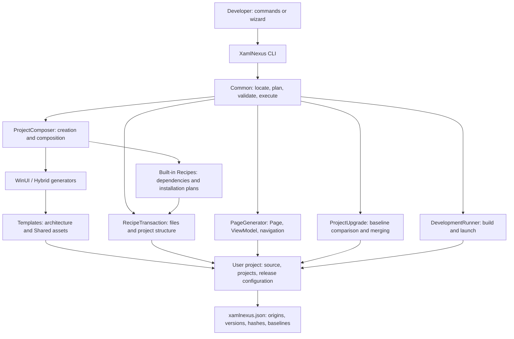
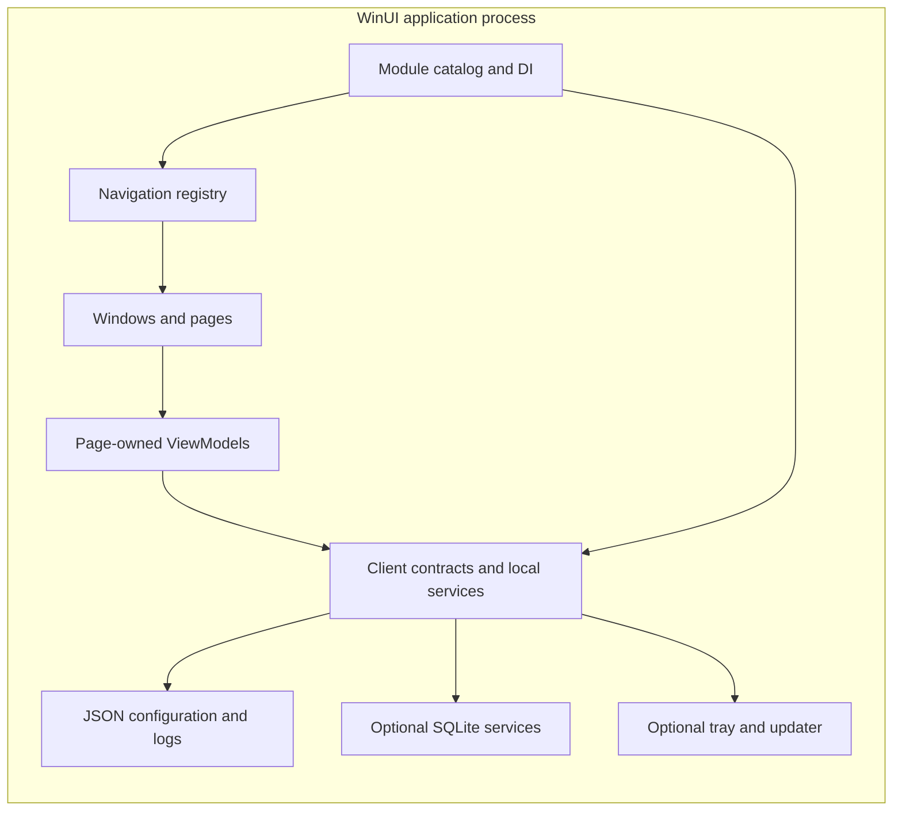
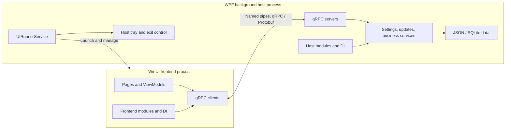
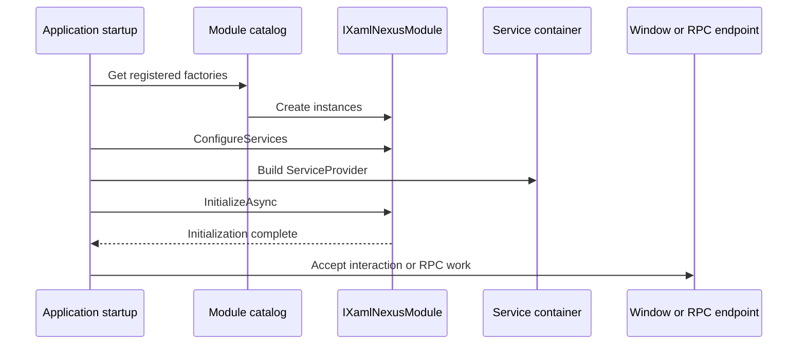
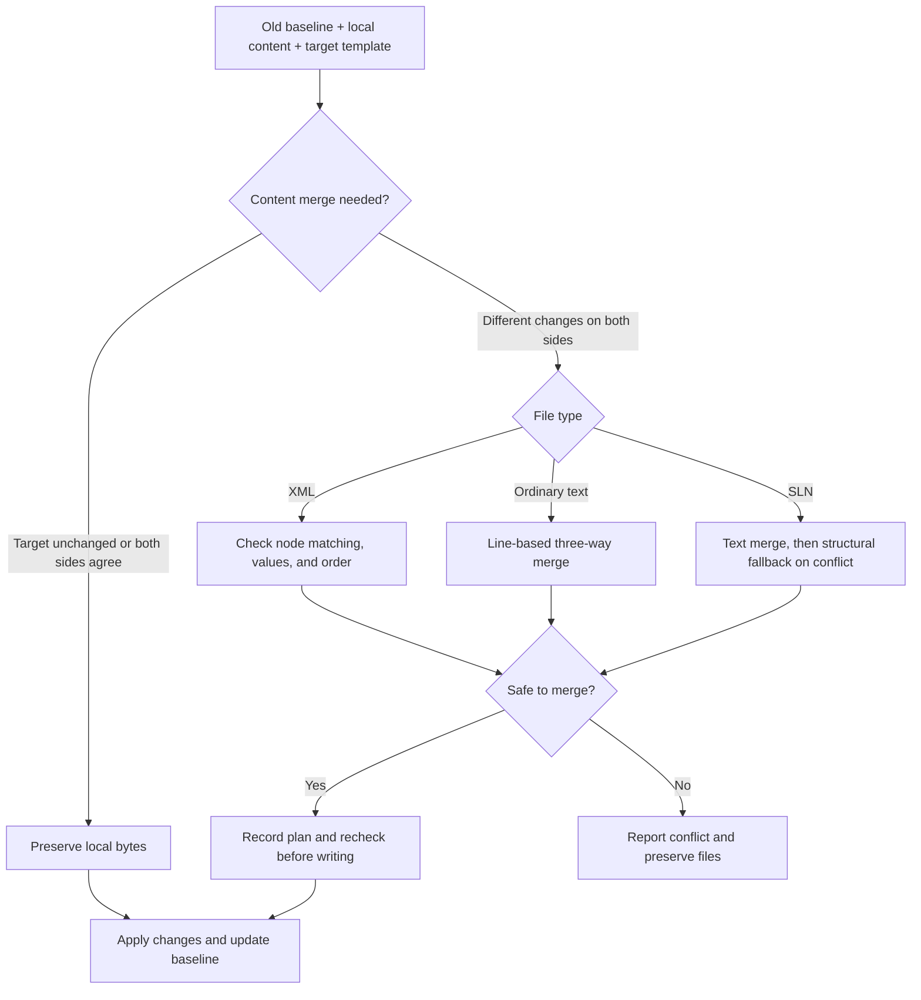

# Architecture and key flows

[English](architecture.md) | [简体中文](architecture.zh-CN.md)

XamlNexus has two parts: a development-time scaffolding tool and the generated client. The tool composes source, changes project structure, and records baselines. The client runs with its own modules, navigation, and service container, without a CLI process dependency.

## 1. Tool and generated assets

| Entry point | Responsibility |
|---|---|
| [Program.cs](../../src/XamlNexus/Program.cs) | Commands, help, previews, and errors |
| [ProjectComposer.cs](../../src/XamlNexus.Common/Projects/ProjectComposer.cs) | Resolve dependencies, generate and compose in a temporary project, validate, then copy into a reserved output directory |
| [BaseGenerator.cs](../../src/XamlNexus.Common/Generators/BaseGenerator.cs) | Copy templates, replace parameters, generate projects, record baselines |
| [PageGenerator.cs](../../src/XamlNexus.Common/Projects/PageGenerator.cs) | Ordinary pages and navigation integration |
| [RecipeTransaction.cs](../../src/XamlNexus.Common/Recipes/RecipeTransaction.cs) | Transactional add, update, and remove |
| [RecipeBatchTransaction.cs](../../src/XamlNexus.Common/Recipes/RecipeBatchTransaction.cs) | Compose and validate multiple installations in a snapshot, then commit together |
| [XamlNexusProjectUpgrade.cs](../../src/XamlNexus.Common/Projects/XamlNexusProjectUpgrade.cs) | Three-way comparison and scaffold upgrades |
| [DevelopmentRunner.cs](../../src/XamlNexus.Common/Projects/DevelopmentRunner.cs) | Debug/x64/unpackaged builds, executable resolution, process lifecycle |

Preset selects process architecture, profile selects initial capabilities, and features selects components during creation. Standard and basic reuse each architecture's templates; basic omits the full settings panel but retains core services.

## 2. Generated application architectures

### Pure WinUI: one application process

Pure WinUI registers and initializes services inside the application. Pages use service interfaces. The SQLite Recipe initializes the database before windows begin accepting interaction.

### Hybrid: WinUI frontend and WPF background host

Both frontends use WinUI and the same page factory and navigation interfaces. Service execution differs: hybrid uses named-pipe RPC to reach the host, which owns SQLite access and migrations.

Frontend and host each have their own DI container and module catalog; they do not share in-memory service instances. Custom business RPCs require protocol definitions and implementations on both sides. `page add` does not generate custom business protocols.

Existing IPC uses gRPC/Protobuf; settings files use JSON. Current templates do not use MessagePack. Protocol changes require consideration of both endpoints, not just frontend models.

## 3. Module startup and page creation

Modules register explicit factories with `[ModuleInitializer]`; no startup assembly scanning is required. Execution is sorted by fully qualified type name, not by an automatic business-dependency graph. Initialization failures abort startup. Hybrid host modules can also provide RPC bindings through `IXamlNexusGrpcModule`.

`INavigationRegistry` records entries consumed by the standard window. Custom windows must consume the same contract, or generate pages with `page add --no-navigation` and integrate them manually.

AppObjectFactory supplies Page and ViewModel constructor dependencies from the existing service container. Created objects belong to the caller. The factory creates neither a page DI scope nor automatic business-object disposal. Containers own shared services; page lifecycle owns resource-bearing ViewModels.

See [module lifecycle](module-lifecycle.md) and [navigation](navigation.md).

## 4. Component installation, customization, and transactions

A Recipe describes how to add a component to a project: which files to copy, which dependencies to add, and which configuration and project references to change. It also declares compatibility requirements. Once added, the application integrates and runs these capabilities through its modules.

Execution proceeds through dependency/conflict resolution, planning, path/content validation, a project write lease, manifest/file revalidation, snapshots, file writes, and manifest update. Batch add performs installations in a temporary snapshot before a combined commit.

On execution failure, transactions attempt to restore files and the manifest; rollback failures are reported. This is application-level failure recovery, not a database-grade atomicity guarantee for power loss or forced process termination.

- Automatic changes reject unsafe, escaping, or linked paths.
- The write lease coordinates scaffolding writes; manifest checks and expected hashes detect stale plans.
- All generated files may be customized. Ordinary content differences do not prohibit running, adding pages, or installing components.
- Removal and updates cannot silently overwrite local changes. Conditional references that cannot be handled safely are rejected explicitly.
- Business pages are not removable Recipes, and application data should not be placed in a component's source-file deletion list.

See the [Recipe contract](recipe-contract.md) and [project manifest](project-manifest.md).

## 5. Scaffold upgrades

The diagram focuses on existing files modified locally. Unmodified files may be updated directly. A target removal of a locally changed file, a missing required file, and other conditions produce separate conflicts.

A successful text merge cannot bypass XML structural checks. Ambiguous repeated unnamed nodes report conflicts without requiring names on every control. Safe cases such as a one-sided whole-child-sequence change do not require individual matching and remain supported.

When both sides differ, comments, CDATA, and some other XML content are unsupported by the current semantic merger and require manual merging. When the target is unchanged or both contents agree, local bytes are retained without rejection for these structures. Hashes and baselines exist to protect user content.

See [project upgrades](../user-guide/project-upgrade.md) for commands, historical-manifest limits, and conflict exports.

## 6. Resources and development running

- **CLI resources:** `src/XamlNexus.Common/Resources/Strings.resx` and `Strings.zh-CN.resx`, read by the tool's LanguageUtil, are distinct from generated application `.resw` resources.
- **Application localization:** `.resw` and WinUI3Localizer update existing controls through attached properties; code-generated text refreshes on language events. Packaged startup replaces local resource copies to avoid old translations after upgrades. See [localization](../user-guide/localization.md).
- **Development running:** `run` builds the startup project, reads MSBuild TargetPath, and launches WinUI or the hybrid host. It manages that run, provides no watch/hot reload, and does not replace installer publishing.
- **Solution formats:** SLN and SLNX are supported. Generated release configuration matches the selected format. Generated CI installs .NET 8 and 10 SDKs; application target frameworks remain defined by project configuration.
