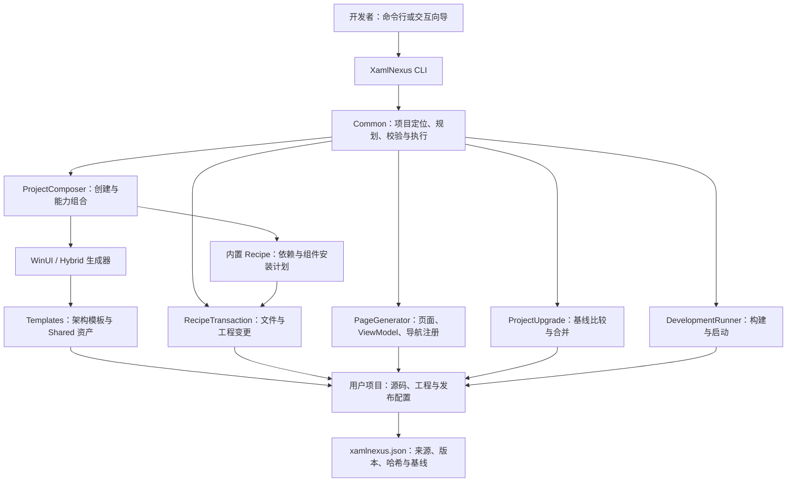
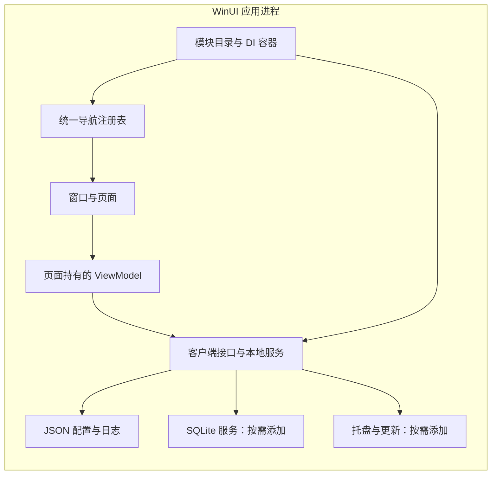
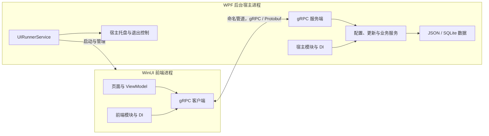
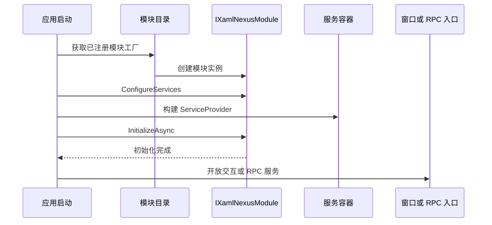
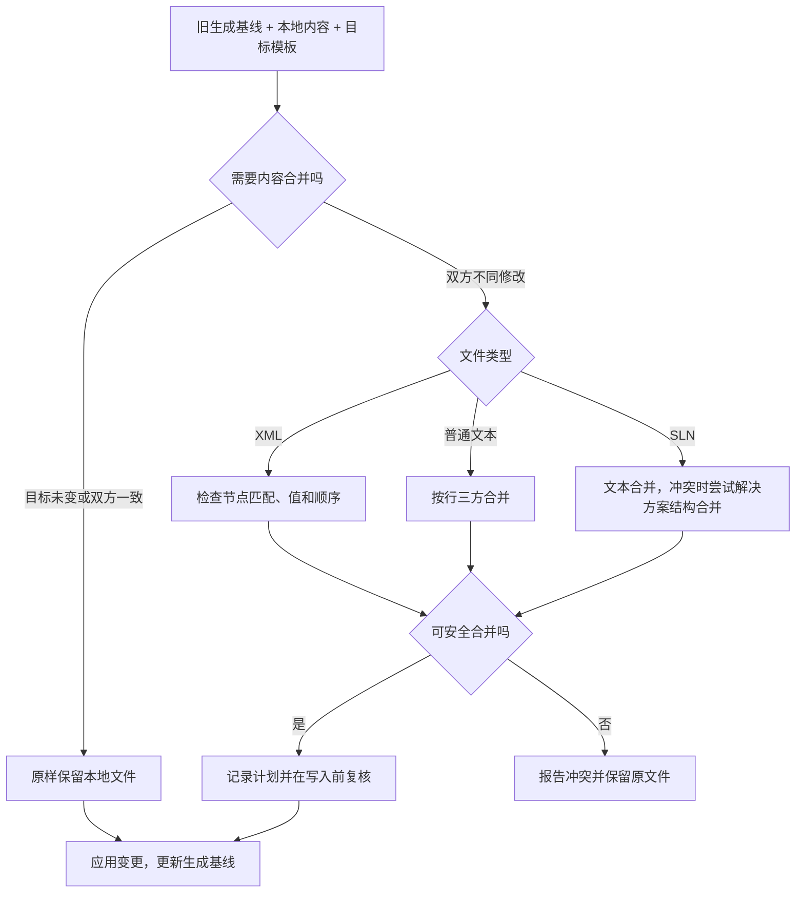

# 整体架构与关键流程

[English](architecture.md) | [简体中文](architecture.zh-CN.md)

XamlNexus 分为开发阶段的脚手架工具和生成后的客户端两部分。工具负责组合源码、修改项目结构、记录基线；客户端通过自身的模块、导航和服务容器运行。生成应用不需要依赖 CLI 进程。

## 1. 工具与生成资产

| 实现入口 | 职责 |
|---|---|
| [Program.cs](../../src/XamlNexus/Program.cs) | 分发命令、输出帮助、预览和错误 |
| [ProjectComposer.cs](../../src/XamlNexus.Common/Projects/ProjectComposer.cs) | 解析组件依赖，在临时项目中完成生成和组合，校验后复制到预留输出目录 |
| [BaseGenerator.cs](../../src/XamlNexus.Common/Generators/BaseGenerator.cs) | 模板复制、名称等参数替换、工程生成与基线记录 |
| [PageGenerator.cs](../../src/XamlNexus.Common/Projects/PageGenerator.cs) | 普通页面生成和导航接入 |
| [RecipeTransaction.cs](../../src/XamlNexus.Common/Recipes/RecipeTransaction.cs) | add／update／remove 的事务执行 |
| [RecipeBatchTransaction.cs](../../src/XamlNexus.Common/Recipes/RecipeBatchTransaction.cs) | 在快照中组合多项安装，再统一提交 |
| [XamlNexusProjectUpgrade.cs](../../src/XamlNexus.Common/Projects/XamlNexusProjectUpgrade.cs) | 生成文件的三方比较与升级执行 |
| [DevelopmentRunner.cs](../../src/XamlNexus.Common/Projects/DevelopmentRunner.cs) | Debug／x64／非打包构建、解析可执行文件路径和进程生命周期 |

`preset` 选择进程架构，`profile` 选择初始能力，`features` 指定创建时添加的组件。standard 和 basic 复用同一架构模板；basic 去掉完整设置界面，核心服务仍保留。

## 2. 生成应用的两种架构

### 纯 WinUI：单应用进程

纯 WinUI 在应用内完成服务注册和初始化。页面层通过接口访问服务，SQLite Recipe 初始化数据库后，窗口才开始承接交互。

### 混合架构：WinUI 前端与 WPF 后台宿主

两种架构的前端都是 WinUI，复用同样的页面工厂和导航接口。差别在于服务执行位置：混合架构通过命名管道 RPC 访问宿主，SQLite 数据访问与迁移在宿主中完成。

混合架构的前端与宿主各有自己的 DI 容器和模块目录，不共享内存中的服务实例。新增业务 RPC 需要定义协议并分别实现服务端与客户端，`page add` 不自动生成业务协议。

现有跨进程协议使用 gRPC／Protobuf，设置文件使用 JSON；当前模板不使用 MessagePack。修改已有协议时应同时考虑两端契约，不能只修改前端模型。

## 3. 模块启动与页面创建

模块通过 `[ModuleInitializer]` 注册显式工厂，不依赖启动时扫描程序集。模块按类型全名排序执行，不能把这个顺序当作业务依赖自动排序；初始化失败会中止启动。混合宿主还允许模块通过 `IXamlNexusGrpcModule` 提供 RPC 绑定。

导航使用 `INavigationRegistry` 登记条目，标准窗口消费注册表。自定义窗口需消费同一接口；不采用它时可用 `page add --no-navigation` 生成页面后手动接入。

页面和 ViewModel 由 `AppObjectFactory` 使用现有服务容器满足构造函数依赖。它们是调用方持有的新对象，不自动创建页面 DI scope，也不自动负责业务对象的释放。共享服务归容器管理，资源型 ViewModel 的清理归页面生命周期管理。

详见[模块生命周期](module-lifecycle.zh-CN.md)和[导航接口](navigation.zh-CN.md)。

## 4. 组件安装、定制与事务

Recipe 描述如何向项目添加组件，包括复制哪些文件、添加哪些依赖，以及修改哪些配置和项目引用，同时声明组件的兼容范围。添加后，应用通过模块接入并运行这些能力。

执行顺序为：解析依赖与冲突 → 生成计划 → 校验路径和预期文件内容 → 获取项目写锁 → 再检查清单和文件 → 保存快照 → 写入变更 → 更新清单。批量添加先在临时快照中逐项执行并校验，最后统一提交。

发生执行异常时，事务尝试恢复已修改文件和清单；回滚失败会报告错误。它提供应用层的失败恢复，不承诺断电或进程被强制终止时实现数据库级原子性。

安全边界包括：

- 自动操作校验目标路径，拒绝越界和链接路径。
- 写锁协调脚手架写入；清单和预期哈希用于发现过期计划。
- 用户可以定制所有生成文件。普通内容差异不会禁止运行、添加页面或组件。
- 移除和更新不能静默覆盖用户修改；条件引用无法安全处理时明确拒绝。
- 业务页面不作为可移除 Recipe 登记；数据文件不应加入源码组件的删除清单。

契约细节见 [Recipe 契约](recipe-contract.zh-CN.md)与[项目清单](project-manifest.zh-CN.md)。

## 5. 脚手架升级

该图聚焦已有文件被用户修改的路径。未修改文件可直接更新；目标删除了用户修改过的文件、所需文件丢失等情况会产生独立冲突。

XML 的文本合并成功也不能绕过结构检查。重复无名节点无法可靠匹配时报告冲突，不要求用户为所有控件添加名称。只有一方修改整个子节点序列等无需逐个匹配的情况仍可安全处理。

双方确有不同修改时，当前 XML 语义合并器不处理注释、CDATA 等部分结构，需要手动合并；目标未变或内容已一致时则原样保留，不因这些结构拒绝升级。哈希和基线始终用于保护用户内容。

详细命令、历史清单限制和冲突文件导出见[项目升级](../user-guide/project-upgrade.zh-CN.md)。

## 6. 资源与开发运行

- **工具语言资源**：CLI 的资源位于 `src/XamlNexus.Common/Resources/Strings.resx` 与 `Strings.zh-CN.resx`，由工具侧 `LanguageUtil` 读取；它们与生成应用的 `.resw` 属于不同层次。
- **多语言**：生成应用使用 `.resw` 与 WinUI3Localizer；附加属性更新已有控件，代码生成文本通过语言变化事件刷新。MSIX 启动时替换本地资源副本，避免沿用旧包翻译。见[本地化](../user-guide/localization.zh-CN.md)。
- **开发运行**：`run` 构建启动项目、读取 MSBuild `TargetPath`，启动纯 WinUI 应用或混合宿主。它管理本次进程运行，不提供 watch／热重载，也不代替发布安装器流程。
- **解决方案格式**：支持 SLN 与 SLNX；生成的发布配置与所选格式一致。生成项目 CI 安装 .NET 8 和 10 SDK，应用目标框架仍按工程配置执行。
